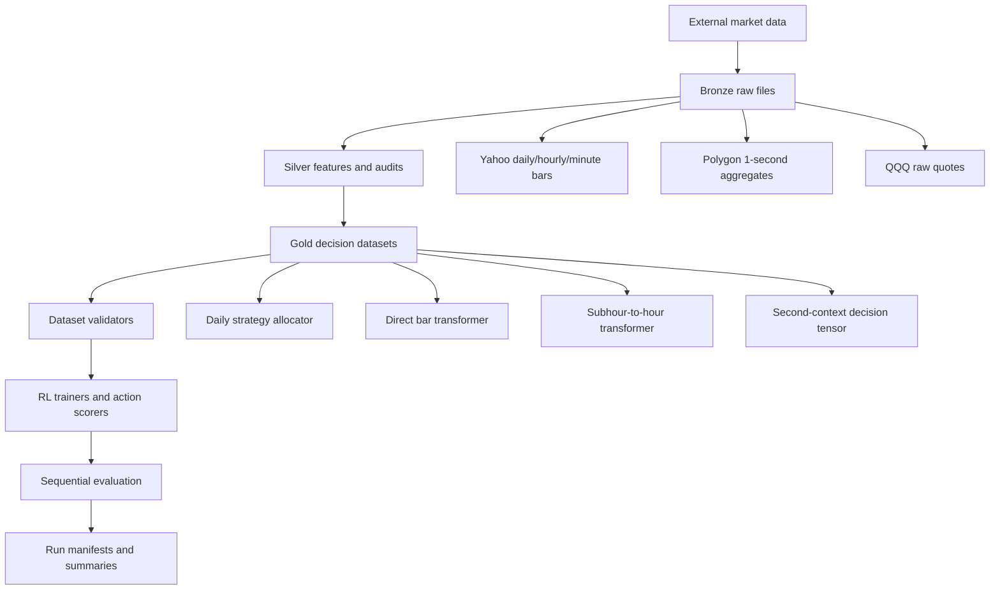

# QuantTrade

QuantTrade is a compact research framework for reinforcement-learning and
action-scoring trading experiments. It focuses on point-in-time datasets,
causal market context, explicit action masks, cost-aware evaluation, and
reportability manifests.

This repository is not a live-trading system. It contains backtesting,
dataset-building, model-training, and research-audit code. Broker credentials,
live order routing, and production execution must remain outside this
repository unless a separate live-trading layer is added with explicit opt-in
guards.

## Table Of Contents

- [Project Purpose](#project-purpose)
- [Current Research Direction](#current-research-direction)
- [Safety And Reportability](#safety-and-reportability)
- [Environment](#environment)
- [Repository Layout](#repository-layout)
- [Architecture](#architecture)
- [Data Roots And Storage](#data-roots-and-storage)
- [Data Layers](#data-layers)
- [Supported Research Workflows](#supported-research-workflows)
- [Data Formats](#data-formats)
- [Model Families](#model-families)
- [Training And Evaluation Artifacts](#training-and-evaluation-artifacts)
- [Common Commands](#common-commands)
- [Script Inventory](#script-inventory)
- [Correctness Contract](#correctness-contract)
- [Testing And Quality Checks](#testing-and-quality-checks)
- [Troubleshooting](#troubleshooting)
- [Glossary](#glossary)

## Project Purpose

QuantTrade is designed to answer research questions like:

- Can a model allocate among strategies, ETFs, or stocks without using future
  data?
- Can high-frequency data be compressed into small decision rows that fit GPU
  training?
- Can a trading policy be evaluated with realistic masks, latency, costs,
  terminal position handling, and baseline comparisons?
- Can datasets and model runs be audited after the fact from manifests?

The framework deliberately separates:

```text
raw market data
-> source-specific bronze files
-> sparse-aware silver features
-> compact gold decision tensors
-> model training
-> sequential evaluation and reportability checks
```

The most important design principle is point-in-time causality. A feature,
constraint, cost estimate, or action feature can be a model input only if it is
available at or before the decision timestamp.

## Current Research Direction

The preferred direction is no longer direct one-minute action switching. The
current framework prioritizes:

- Hour-level decision grids for stability.
- Minute-level or second-level source data for context.
- Causal subhour encoders that learn intrahour dynamics.
- Compact second-context decision tensors for large top-volume universes.
- Action-conditioned models that score each action from market context,
  action metadata, costs, portfolio state, and constraints.

The second-context path is currently a contextual action scorer plus sequential
diagnostics. It is useful for ranking actions under a fixed decision dataset,
but it should not be overstated as a complete end-to-end sequential RL policy
until prior-action state, order constraints, and risk budgets are trained
directly in the environment.

## Safety And Reportability

This is research code. A result is not reportable unless all of the following
are true:

- Every model input is available no later than the decision timestamp.
- Rewards are realized fully inside the split being evaluated.
- Train, validation, and test schemas match exactly.
- Feature and normalizer fit windows end before validation/test usage.
- Trading constraints are applied during both training and evaluation.
- Costs are leg-aware and action-specific when possible.
- Terminal positions are either liquidated with cost or reported as open.
- Registered baselines and cost/frequency stress tests are included.
- Source data completeness and known limitations are declared in manifests.
- Invalid action returns are stored as `NaN`, never silently as zero.

This repository should not contain secrets. `.env.example` documents optional
environment variable names only:

```text
RAPIDAPI_KEY
RAPIDAPI_HOST
BROKER_TRADING_PASSWORD
```

Do not commit actual API keys, S3 credentials, broker credentials, large raw
datasets, generated model checkpoints, or generated run directories.

## Environment

Use the `ml1` conda environment used by this workspace:

```bash
cd QuantTrade
conda run -n ml1 python -m pip install -e ".[dev,data]"
```

Core dependencies are intentionally small:

- Python `>=3.11`
- `torch>=2.6,<3`
- `numpy>=2.2,<3`
- Optional data stack: `pandas`, `pyarrow`
- Optional local LLM inference stack: `transformers`, `accelerate`,
  `sentencepiece`
- Development tools: `pytest`, `ruff`, `mypy`

For offline LLM feature extraction with the downloaded local model:

```bash
conda run -n ml1 python -m pip install -e ".[llm]"
```

When `scripts/build_news_llm_features.py` imports precomputed LLM outputs and
the selected `--local-model-preset` manifest is missing, it auto-downloads that
preset into `../LLM/<model>/` and writes `download_manifest.json`. Use
`--no-auto-download-local-model` to require a pre-existing manifest. The RL
training scripts themselves do not download or call LLMs; they only consume
frozen feature tables and sidecars.

Current downloaded local LLM checkpoint, used for smoke tests and small offline
feature-extraction experiments:

```text
../LLM/Qwen3-1.7B
Qwen/Qwen3-1.7B@70d244cc86ccca08cf5af4e1e306ecf908b1ad5e
```

Current local analyst extractor stack for frozen feature builds:

```text
Primary:   Qwen/Qwen3-1.7B
Validator: google/gemma-4-26B-A4B-it
Fallback:  mistralai/Mistral-Small-3.2-24B-Instruct-2506
Serving:   local_transformers with JSON-schema structured outputs
```

`Qwen/Qwen3.6-27B` remains an explicit larger-model preset, but it is not the
default local path on the 10 GiB GPU used for this project stage.

The 2026 LLM stack is diagnostic for retrospective 2023-2026 backtests unless
the extractor model was available before the first decision timestamp. Training
never calls an LLM directly; it consumes only frozen feature tables and sidecars.

Check CUDA and AMP availability:

```bash
conda run -n ml1 python scripts/check_torch_cuda.py \
  --device auto \
  --matrix-size 2048 \
  --repeats 2 \
  --amp
```

Most training scripts accept:

```text
--device auto
--amp
--amp-dtype fp16|bf16
--min-free-vram-gb 8
--target-vram-gb 9.5   # legacy ballast; see warning below
```

`--device auto` uses CUDA when available. `--amp` enables mixed precision only
when the chosen device is CUDA. `--amp-dtype` selects the autocast dtype: `fp16`
(default) or `bf16` (wider exponent range, preferred on Ampere/Hopper; GradScaler
is disabled for `bf16`). `--min-free-vram-gb` fails fast before training when free
CUDA memory is below the given margin.

`--target-vram-gb` is **legacy CUDA ballast reservation, not a memory cap**: it
reserves byte tensors after warmup to *raise* used VRAM toward the target (it does
not shard, offload, or limit memory). Leave it unset for large-model training
unless you deliberately want to reserve extra VRAM; use `--min-free-vram-gb` to
guard headroom instead.

## Repository Layout

```text
QuantTrade/
  README.md
  pyproject.toml
  .env.example
  docs/
    decision_tensor_protocol.md
    stock_covariate_integration.md
    news_llm_covariate_protocol.md
  src/rl_quant/
    core.py
    action_risk.py
    confidence.py
    bar_transformer.py
    decision_framework.py
    hourly_transformer.py
    intraday_data.py
    intraday_dqn.py
    minute_to_hour_transformer.py
    quote_utils.py
    research_protocol.py
    second_context_transformer.py
    strategy_data.py
    strategy_dqn.py
    trading_constraints.py
    data_sources/
      polygon_second_aggs.py
    features/
      stock_second_context.py
  scripts/
    *.py
  tests/
    test_correctness.py
```

Important modules:

| Module | Purpose |
| --- | --- |
| `core.py` | Torch runtime setup, CUDA/AMP helpers, replay buffers, metrics, and shared Q-network blocks. |
| `confidence.py` | Action-level confidence tensors, residual calibration, probability-of-profit estimates, and compressed confidence artifacts. |
| `research_protocol.py` | Dataset/model manifests, stable hashes, fit-window validation, benchmark registry, and stress evidence helpers. |
| `decision_framework.py` | Point-in-time feature availability, readiness scoring, action eligibility, and decision dataset checks. |
| `trading_constraints.py` | Action masks, min-hold, cooldown, switch caps, order-leg caps, and leg-aware hysteresis. |
| `action_risk.py` | Action metadata, leverage/inverse flags, risk buckets, and stable action metadata hashes. |
| `hourly_transformer.py` | Direct bar-level causal transformer DQN allocator. |
| `minute_to_hour_transformer.py` | Hierarchical subhour-to-hour transformer for hourly allocation decisions from minute or second context. |
| `second_context_transformer.py` | Action-conditioned transformer scorer for compact second-context decision tensors. |
| `features/stock_second_context.py` | Sparse-aware 1-second stock context compression and gold decision tensor validation. |
| `data_sources/polygon_second_aggs.py` | Polygon second aggregate manifest loading, timestamp handling, and audit utilities. |
| `intraday_data.py`, `intraday_dqn.py` | QQQ quote/NBBO feature loading and intraday DQN training. |
| `strategy_data.py`, `strategy_dqn.py` | Daily strategy-allocation dataset loading and DQN allocation. |

## Architecture



Data should move forward through the layers. Training code should not parse raw
vendor files directly when a validated dataset builder exists.

## Data Roots And Storage

Scripts are designed to run from the repository root.

Most legacy scripts use `PROJECT_ROOT`:

```text
PROJECT_ROOT = checkout root
derived/      = generated universes, downloaded Yahoo data, backtests, and runs
data/         = local data when the checkout is standalone
```

The newer high-frequency scripts use a shared data root:

```text
if ../data exists:
    DATA_ROOT = ../data
else:
    DATA_ROOT = data
```

Expected local high-frequency paths in this workspace, written relative to the
repository root:

```text
../data/polygon/second_aggs/top500_common_stocks_2025_to_2026-06-15
../data/rl_decision_datasets
../data/rl_hour_from_minute
../data/rl_hour_from_second
../data/second_context_runs
```

Large generated assets should stay under `data/` or `derived/`, not inside
`src/`, `scripts/`, or `tests/`.

## Data Layers

### Bronze

Bronze files are raw or minimally normalized source files.

Examples:

- Yahoo daily/hourly/minute OHLCV CSV files.
- Polygon 1-second aggregate Parquet files.
- Raw QQQ quote files used to build NBBO buckets.

Polygon second aggregate layout:

```text
data/polygon/second_aggs/<dataset>/
  manifest.csv
  dataset_manifest.json
  SYMBOL/YYYY/MM/YYYY-MM-DD.parquet
```

`manifest.csv` is the source of truth for symbol-day status. Do not infer
completion only from recursive files on disk.

### Silver

Silver features are source-specific cleaned or compressed tables.

Examples:

- Sparse-aware stock second context CSV from `build_stock_second_silver_features.py`.
- Market ecology daily context from `learn_market_ecological_attention.py`.
- NBBO bucket features from `extract_nbbo_features.py`.

### Gold

Gold datasets are model-ready decision datasets.

Examples:

- `state_features.csv` plus `action_returns.csv` for daily strategy allocation.
- `hourly_transformer_dataset.pt` or `minute_transformer_dataset.pt` for direct bar transformers.
- `hour_from_minute_dataset.pt` or `hour_from_second_dataset.pt` for hourly decisions from subhour context.
- `dataset.pt` plus manifests for second-context decision tensors.

`.pt` files are trusted local training caches. For large long-term datasets,
the archival target should be Zarr/Arrow/Parquet arrays plus JSON manifests, as
defined in [the decision tensor protocol](docs/decision_tensor_protocol.md).

## Supported Research Workflows

### 1. Daily Strategy Allocation

Purpose:

- Test and allocate among complete daily strategy return curves.
- Use daily market/strategy features and optional market ecology context.

Typical actions:

- `BH_QQQ`: buy-and-hold QQQ benchmark/fallback action.
- Cross-sectional momentum variants.
- Dual momentum variants.
- Filtered momentum variants.

Frequency:

- Daily close-to-close rows.
- Current scripts focus on 2026 research.

Primary scripts:

```text
massive_2026_momentum_test.py
rank_2026_strategy_stability.py
build_2026_rl_strategy_dataset.py
learn_market_ecological_attention.py
merge_market_ecology_with_rl_states.py
train_strategy_allocator.py
```

### 2. Direct Bar Transformer

Purpose:

- Train a causal-transformer DQN over rolling `1h` or `1m` bar windows.
- Score ETF or stock actions with explicit masks and risk constraints.

Frequency:

- Yahoo `1h` or `1m` exchange-session bars.

Primary scripts:

```text
fetch_top_volume_universes.py
download_hourly_ohlcv.py
download_intraday_ohlcv.py
build_hourly_transformer_dataset.py
build_minute_transformer_dataset.py
train_hourly_causal_transformer_rl.py
train_minute_causal_transformer_rl.py
```

### 3. Subhour-To-Hour Transformer

Purpose:

- Keep the decision and reward grid hourly.
- Let a subhour encoder learn minute-level or second-level intrahour dynamics.
- Let an hour encoder learn multi-hour regime context.

Canonical source-context keys:

```text
subhour_features
subhour_mask
subhour_timestamp_grid
subhour_feature_names
```

Legacy aliases are still written and loaded:

```text
minute_features
minute_mask
minute_timestamp_grid
minute_feature_names
```

Primary scripts:

```text
build_hourly_from_minute_context_dataset.py
build_hourly_from_second_context_dataset.py
train_hourly_from_minute_context_rl.py
train_hourly_from_second_context_rl.py
```

### 4. Second-Context Decision Tensor

Purpose:

- Compress top-stock sparse 1-second bars into compact market-context tokens.
- Build one gold decision row per decision timestamp.
- Score actions with action-specific features, masks, costs, target weights,
  quality scores, and execution timestamps.

Frequency:

- Source bars: Polygon `1s` aggregates.
- Decision grid: `5m`, `15m`, `30m`, or `60m`.
- Default examples use `15m`.

Primary scripts:

```text
audit_polygon_second_aggs.py
build_stock_second_silver_features.py
build_second_context_decision_dataset.py
train_second_context_action_scorer.py
evaluate_second_context_dataset.py
```

### 5. Intraday QQQ NBBO DQN

Purpose:

- Train a discrete short/flat/long intraday DQN on QQQ NBBO bucket features.

Frequency:

- Raw quotes converted to fixed buckets.
- Default bucket size is one second.

Primary scripts:

```text
extract_nbbo_features.py
train_dqn_agent.py
```

## Data Formats

For the full compact decision tensor standard, read:

[docs/decision_tensor_protocol.md](docs/decision_tensor_protocol.md)

For the newly downloaded Polygon stock-specific covariates and the integration
gap before they become model inputs, read:

[docs/stock_covariate_integration.md](docs/stock_covariate_integration.md)

For the narrow, auditable news LLM covariate layer, read:

[docs/news_llm_covariate_protocol.md](docs/news_llm_covariate_protocol.md)

That layer is an offline feature-extraction path only. QuantTrade training
does not call an LLM directly, and `stock_fundamental_llm_v1` remains a planned
separate typed group rather than a current model input.

The root README gives the operational summary below.

### Daily Allocator Dataset

Files:

```text
state_features.csv
action_returns.csv
action_manifest.csv
dataset_manifest.json
```

Rules:

- `state_features.csv` has `Date` plus numeric features available through that date.
- `action_returns.csv` has `Date` plus one numeric return column per strategy action.
- `action_manifest.csv` maps action index to strategy name, benchmark flag,
  backtest fields, and variation/risk fields.
- Missing action returns should be fixed upstream, not coerced to zero.

### Direct Bar Transformer Dataset

Typical files:

```text
hourly_transformer_dataset.pt
minute_transformer_dataset.pt
state_features.csv
action_returns.csv
metadata.json
dataset_manifest.json
```

Required payload fields:

```text
timestamps
next_timestamps
feature_names
action_names
features
action_returns
bar_interval
periods_per_year
```

Rules:

- `timestamps` are decision timestamps.
- `next_timestamps` are reward horizon end timestamps.
- Split builders reject rewards whose `next_timestamp` is after split end.
- Valid action returns must be finite.
- Invalid action returns must be `NaN` when an `action_valid_mask` is present.

### Subhour-To-Hour Dataset

Typical files:

```text
hour_from_minute_dataset.pt
hour_from_second_dataset.pt
metadata.json
dataset_manifest.json
README.md
```

Required payload fields:

```text
decision_timestamps
next_timestamps
subhour_timestamp_grid
subhour_feature_names
hour_feature_names
action_names
subhour_features
subhour_mask
hour_features
action_returns
hours_lookback
context_bars_per_hour
source_bar_interval
decision_grid_minutes
periods_per_year
```

Shape:

```text
subhour_features: [decisions, hours_lookback, context_bars_per_hour, feature_count]
subhour_mask:     [decisions, hours_lookback, context_bars_per_hour]
hour_features:    [decisions, hours_lookback, hour_feature_count]
action_returns:   [decisions, actions]
```

Rules:

- Default decision grid is fixed at one hour.
- Source data can be `1m` or `1s`.
- For `1s` data, `bar_latency_ms >= 1000`.
- Masked sparse source bars stay masked rather than forward-filled.
- Context timestamps must be available no later than the decision timestamp.

### Polygon Second-Bar Bronze Dataset

Typical files:

```text
manifest.csv
dataset_manifest.json
SYMBOL/YYYY/MM/YYYY-MM-DD.parquet
```

Expected semantics:

- `timestamp_ms` is the canonical machine timestamp.
- `timestamp_utc` and `timestamp_exchange` are display/filtering helpers.
- A missing second row means no eligible trade in that second.
- Missing rows are not zero returns.
- Download status and source access must be represented in manifests.

### Second-Context Gold Dataset

Typical files:

```text
dataset.pt
dataset_manifest.json
data_quality_report.json
feature_manifest.json
action_metadata.json
split_manifest.json
schema.json
metadata.json
```

Core payload fields:

```text
decision_timestamps
next_timestamps
decision_timestamps_ms
next_timestamps_ms
market_context
market_context_mask
market_context_available_timestamps_ms
action_features
action_features_available_timestamps_ms
action_returns
decision_action_valid_mask
action_valid_mask
label_valid_mask
entry_fill_observed_mask
reward_exit_observed_mask
action_mask_reason_code
action_cost_bps
action_cost_available_timestamps_ms
action_target_weights
action_quality_score
entry_execution_timestamps_ms
exit_execution_timestamps_ms
execution_model
portfolio_state
portfolio_state_available_timestamps_ms
constraint_state
constraint_state_available_timestamps_ms
decision_quality_score
force_cash_mask
valid_start_indices
segment_ids
session_ids
feature_names
feature_names_by_tensor
action_names
action_metadata
split_manifest
dataset_manifest
data_quality_report
tensor_availability
model_input_keys
label_keys
forbidden_model_input_keys
payload_hash
```

Rules:

- `protocol_version` is `decision_tensor_v1`.
- `decision_tensor_protocol_version` is `1.0.0`.
- Current schema is `stock_second_context_decision_v3`.
- `dataset_schema_version` is `second_context_gold_v1`.
- `CASH` is action index `0`.
- `CASH` return, cost, and target weight are zero.
- `decision_action_valid_mask` is the ex-ante mask used for action selection.
- `action_valid_mask` is a legacy alias of `decision_action_valid_mask`.
- `label_valid_mask` marks realized return labels that exist after the reward
  horizon and is forbidden as model input.
- `entry_fill_observed_mask` and `reward_exit_observed_mask` are historical
  audit masks for label construction and are forbidden as model inputs.
- Action returns are finite only where `decision_action_valid_mask` and
  `label_valid_mask` are both true; otherwise they must be `NaN`, except CASH.
- Dataset builders must not drop a decision row solely because a selectable
  non-CASH action lacks a future reward label. Keep the row, store `NaN`, and
  let `label_valid_mask` drive loss/evaluation/reportability.
- Legacy payloads with only `action_valid_mask` and no explicit decision-vs-label
  mask semantics are diagnostic-only and non-reportable.
- `action_target_weights` are signed target exposures. Generated stock-second
  datasets are long-only today, but evaluators charge costs on absolute
  executed exposure so future short variants do not create negative costs.
- Action feature and cost availability timestamps must be at or before the
  decision timestamp, or `-1` when unavailable.
- `model_input_keys` must not overlap `forbidden_model_input_keys`.

## Model Families

| Family | File | State | Actions | Training Style | Best Use |
| --- | --- | --- | --- | --- | --- |
| Intraday QQQ DQN | `intraday_dqn.py` | NBBO bucket windows | short, flat, long | DQN | Quote-level QQQ experiments. |
| Daily strategy DQN | `strategy_dqn.py` | Daily features | strategy curves | DQN | 2026 daily strategy allocation. |
| Direct bar transformer | `hourly_transformer.py` | Rolling bar context | `CASH` plus ETF/stock actions | DQN | Hourly/minute bars with constraints. |
| Subhour-to-hour transformer | `minute_to_hour_transformer.py` | Minute/second bars inside hour tokens | `CASH` plus ETF/stock actions | DQN | Preferred stable high-frequency RL path. |
| Second-context scorer | `second_context_transformer.py` | Compact second-derived context plus action features | action-conditioned instruments | Supervised/action scorer with sequential diagnostics | Large-universe second-context experiments. |

## Training And Evaluation Artifacts

Training run directories normally include some or all of:

```text
model.pt
summary.json
model_manifest.json
dataset_manifest.json
feature_manifest.json
data_quality_report.json
split_manifest.json
reportability.json
decision_logs.jsonl
selected_action_paths.pt
selected_action_confidence_train.jsonl
selected_action_confidence_val.jsonl
selected_action_confidence_test.jsonl
action_confidence_train.npz
action_confidence_val.npz
action_confidence_test.npz
action_confidence_manifest.json
```

Important artifact meanings:

- `model.pt`: trusted local checkpoint cache.
- `summary.json`: high-level train/validation/test metrics and stress results.
- `model_manifest.json`: model kind, hyperparameters, selected checkpoint,
  feature/action schema, validation protocol, and baselines.
- `dataset_manifest.json`: source, universe, timestamps, schema hashes, known
  limitations, and reportability fields.
- `feature_manifest.json`: feature names, feature groups, feature fit windows,
  normalization details when available.
- `split_manifest.json`: train/validation/test row counts and reward-end caps.
- `reportability.json`: whether the run is reportable and why not. For
  second-context runs this includes separate `conversion_reportable`,
  `dataset_reportable`, `evaluation_reportable`, and
  `confidence_reportable` gates plus grouped `reportability_errors`.
- `decision_logs.jsonl`: row-level selected actions, Q-values, masks, costs,
  equity, and execution metadata for sequential evaluation.
- `selected_action_paths.pt`: replayable selected action indices plus source
  row indices for train/validation/test. Schema v2 stores
  `raw_policy_actions`, `constraint_adjusted_actions`, `requested_actions`,
  `executed_actions`, `selection_reasons`, and rows for each split. Legacy
  `train_actions`/`val_actions`/`test_actions` are executed actions.
- `action_confidence_*.npz`: all-action confidence tensors with shape
  `[rows, actions, confidence_fields]`.
- `selected_action_confidence_*.jsonl`: selected/executed action confidence,
  requested action, raw policy action, second-best action, margins, and OOD
  score for train, validation, and test selected rows.
- `action_confidence_manifest.json`: confidence method, calibration split,
  hurdle, interval alpha, confidence semantics, OOD status, reportability,
  field names, calibration metrics, and warnings.

Action-confidence artifacts are separate from raw policy scores. The current
second-context trainer writes residual-calibrated single-model confidence by
default. The tensor fields are:

```text
valid_action
q_mean
q_std_epistemic
q_std_total
q_lcb_05
q_ucb_95
p_positive
profit_confidence
p_beats_cash
p_best
p_best_member_vote
p_best_draw
selection_confidence
advantage_mean
advantage_lcb
rank
confidence
```

`p_best` is a backward-compatible alias of `p_best_draw`, the Monte Carlo
probability that the action is best under the calibrated predictive return
distribution. `p_best_member_vote` is only an ensemble vote fraction; with a
single model it is an argmax indicator and the manifest warns accordingly.
`profit_confidence` is an alias of `p_positive`, while `selection_confidence`
is `p_best_draw` after any active OOD penalty. Invalid actions keep
`valid_action = 0`, `p_best = 0`, and `NaN` for scalar confidence/probability
fields so invalid choices cannot silently improve averages. `q_mean` is stored
in return units after dividing model scores by the training `reward_scale`.

The fixed field names `q_lcb_05` and `q_ucb_95` are legacy names. Always read
`action_confidence_manifest.json.interval_quantiles` for the actual lower and
upper quantiles when `--confidence-interval-alpha` is not `0.05`. Confidence is
marked non-reportable when the calibration split is reused for checkpoint
selection or when test data is used for calibration.

Sequential second-context evaluation uses
`same_action_weight_policy = freeze_executed_weight_until_action_change`.
If the same action id is held across rows, the previously executed exposure is
carried forward until the action changes or the position is liquidated.

## Common Commands

### Quality Checks

```bash
conda run -n ml1 ruff check .
conda run -n ml1 python -m compileall -q src scripts tests
conda run -n ml1 pytest -q
```

### CUDA Check

```bash
conda run -n ml1 python scripts/check_torch_cuda.py \
  --device auto \
  --matrix-size 2048 \
  --repeats 2 \
  --amp
```

### Universe Bootstrap

Fetch top US market-cap universe:

```bash
conda run -n ml1 python scripts/fetch_top_us_market_cap_universe.py \
  --limit 1000
```

Fetch top-volume stock and ETF universes:

```bash
conda run -n ml1 python scripts/fetch_top_volume_universes.py \
  --stock-limit 1000 \
  --etf-limit 500
```

### Yahoo Daily/Hourly/Minute Data

Daily:

```bash
conda run -n ml1 python scripts/download_daily_ohlcv.py --help
```

Hourly:

```bash
conda run -n ml1 python scripts/download_hourly_ohlcv.py --help
```

Minute:

```bash
conda run -n ml1 python scripts/download_intraday_ohlcv.py --help
```

Yahoo Finance limits true `1m` data to a short recent window. Use explicit
dates and manifests when rebuilding minute bars.

### Daily Strategy Research

Run massive 2026 momentum tests:

```bash
conda run -n ml1 python scripts/massive_2026_momentum_test.py
```

Rank strategies by variance and stable performance:

```bash
conda run -n ml1 python scripts/rank_2026_strategy_stability.py
```

Build the daily RL allocator dataset:

```bash
conda run -n ml1 python scripts/build_2026_rl_strategy_dataset.py
```

Learn market ecological attention context:

```bash
conda run -n ml1 python scripts/learn_market_ecological_attention.py
```

Merge market ecology into RL states:

```bash
conda run -n ml1 python scripts/merge_market_ecology_with_rl_states.py
```

Train the daily strategy allocator:

```bash
conda run -n ml1 python scripts/train_strategy_allocator.py \
  --device auto \
  --amp
```

### Direct Hourly Bar Transformer

Build an hourly transformer dataset:

```bash
conda run -n ml1 python scripts/build_hourly_transformer_dataset.py \
  --output-dir derived/rl_hourly/top_volume_2026
```

Train the hourly causal-transformer DQN:

```bash
conda run -n ml1 python scripts/train_hourly_causal_transformer_rl.py \
  --dataset derived/rl_hourly/top_volume_2026/hourly_transformer_dataset.pt \
  --device auto \
  --amp \
  --target-vram-gb 9.5
```

The direct bar trainer is risk-aware by default. It supports:

- Leveraged and inverse action controls.
- Risk-scaled target action weights.
- Same-group exposure caps.
- Minimum hold and cooldown.
- Daily and episode switch caps.
- Daily and episode order-leg caps.
- Leg-aware switch costs.
- Cost stress baselines.

### Direct Minute Bar Transformer

Build the default recent minute dataset:

```bash
conda run -n ml1 python scripts/build_minute_transformer_dataset.py
```

Train the minute-level causal-transformer DQN:

```bash
conda run -n ml1 python scripts/train_minute_causal_transformer_rl.py \
  --device auto \
  --amp \
  --target-vram-gb 9.5
```

Direct minute training is supported, but it is not the preferred default for
stable research because it can overfit and switch too frequently.

### Preferred Minute-To-Hour Path

Build hourly decisions from minute context:

```bash
conda run -n ml1 python scripts/build_hourly_from_minute_context_dataset.py
```

Train the hierarchical minute-to-hour transformer:

```bash
conda run -n ml1 python scripts/train_hourly_from_minute_context_rl.py \
  --device auto \
  --amp \
  --target-vram-gb 9.5 \
  --max-switches-per-episode 3 \
  --max-order-legs-per-episode 6
```

Warm-start rolling periods from a prior checkpoint:

```bash
conda run -n ml1 python scripts/train_hourly_from_minute_context_rl.py \
  --device auto \
  --amp \
  --target-vram-gb 9.5 \
  --warm-start-model data/rl_hour_from_minute_runs/previous_period/model.pt
```

Warm-start loading is allowed only when minute/subhour feature names, hour
feature names, action names, and constraint feature schema match the current
dataset and code.

### Second-To-Hour Path

Build hourly decisions from Polygon 1-second aggregate context:

```bash
conda run -n ml1 python scripts/build_hourly_from_second_context_dataset.py
```

Train the second-to-hour transformer:

```bash
conda run -n ml1 python scripts/train_hourly_from_second_context_rl.py \
  --device auto \
  --amp \
  --target-vram-gb 9.5
```

This path keeps hourly decisions while allowing each hour token to consume up
to 3,600 causal one-second source bars. Long second-level streams are compressed
to `--max-subhour-tokens` before intrahour attention.

### Polygon Second-Context Gold Dataset

Audit downloaded Polygon second bars:

```bash
conda run -n ml1 python scripts/audit_polygon_second_aggs.py \
  --root ../data/polygon/second_aggs/top500_common_stocks_2025_to_2026-06-15 \
  --manifest ../data/polygon/second_aggs/top500_common_stocks_2025_to_2026-06-15/manifest.csv \
  --dataset-manifest ../data/polygon/second_aggs/top500_common_stocks_2025_to_2026-06-15/dataset_manifest.json \
  --source-access REST
```

Build compact silver features:

```bash
conda run -n ml1 python scripts/build_stock_second_silver_features.py \
  --start 2026-06-12T00:00:00+00:00 \
  --end-exclusive 2026-06-13T00:00:00+00:00 \
  --block-seconds 300 \
  --smoke
```

Build a gold second-context decision dataset:

```bash
conda run -n ml1 python scripts/build_second_context_decision_dataset.py \
  --decision-interval 15m \
  --context-seconds 3600 \
  --block-seconds 300 \
  --bar-latency-ms 1000 \
  --execution-latency-ms 1000 \
  --actions CASH,QQQ,SPY \
  --smoke
```

Train the action-conditioned second-context scorer:

```bash
conda run -n ml1 python scripts/train_second_context_action_scorer.py \
  --device auto \
  --amp \
  --epochs 500 \
  --batch-size 256 \
  --micro-batch-size 8 \
  --eval-batch-size 16 \
  --checkpoint-every-epochs 5 \
  --target-vram-gb 9.5
```

`--batch-size` is the effective optimizer batch. `--micro-batch-size` is the
actual transformer batch placed on CUDA before gradient accumulation, so long
runs can use many epochs over the full dataset while keeping peak memory inside
the 9.5 GiB target. Validation, test scoring, and confidence artifacts use
`--eval-batch-size` and are also batched.

Evaluate a second-context dataset:

```bash
conda run -n ml1 python scripts/evaluate_second_context_dataset.py
```

### QQQ Intraday NBBO

Extract quote/NBBO features when raw quote data is available:

```bash
conda run -n ml1 python scripts/extract_nbbo_features.py --help
```

Train the QQQ intraday DQN:

```bash
conda run -n ml1 python scripts/train_dqn_agent.py \
  --train-dates 2025-01-02,2025-01-03 \
  --val-dates 2025-01-06 \
  --test-dates 2025-01-07 \
  --auto-extract \
  --device auto \
  --amp
```

### Manifest Validation

Validate dataset and model manifests:

```bash
conda run -n ml1 python scripts/validate_research_protocol.py \
  --dataset-manifest data/rl_hour_from_minute/top_volume_1m_recent/dataset_manifest.json
```

Multiple manifests can be passed by repeating `--dataset-manifest` or
`--model-manifest`.

## Script Inventory

| Script | Role |
| --- | --- |
| `scripts/check_torch_cuda.py` | Verify Torch, CUDA, AMP, and matrix-multiply runtime. |
| `scripts/fetch_top_us_market_cap_universe.py` | Fetch a current top US equity universe by market cap. |
| `scripts/fetch_top_volume_universes.py` | Fetch top-volume US stocks and ETFs. |
| `scripts/download_daily_ohlcv.py` | Download daily OHLCV data. |
| `scripts/download_hourly_ohlcv.py` | Download Yahoo hourly OHLCV data. |
| `scripts/download_intraday_ohlcv.py` | Download Yahoo intraday/minute OHLCV data. |
| `scripts/massive_2026_momentum_test.py` | Test many daily momentum variants on 2026 data. |
| `scripts/rank_2026_strategy_stability.py` | Rank strategies by variance and stable performance. |
| `scripts/analyze_2026_strategy_variation.py` | Analyze 2026 strategy performance variation. |
| `scripts/build_2026_rl_strategy_dataset.py` | Build daily strategy allocator datasets. |
| `scripts/learn_market_ecological_attention.py` | Learn CREDO-style causal ecological market context. |
| `scripts/merge_market_ecology_with_rl_states.py` | Merge market ecology features into daily RL states. |
| `scripts/train_strategy_allocator.py` | Train the daily strategy DQN allocator. |
| `scripts/build_hourly_transformer_dataset.py` | Build direct hourly/minute bar transformer datasets. |
| `scripts/build_minute_transformer_dataset.py` | Wrapper for recent direct minute transformer dataset defaults. |
| `scripts/train_hourly_causal_transformer_rl.py` | Train direct bar causal-transformer DQN. |
| `scripts/train_minute_causal_transformer_rl.py` | Wrapper for direct minute causal-transformer DQN defaults. |
| `scripts/build_hourly_from_minute_context_dataset.py` | Build hourly decisions from causal minute or subhour context. |
| `scripts/build_hourly_from_second_context_dataset.py` | Wrapper for hourly decisions from Polygon one-second context. |
| `scripts/train_hourly_from_minute_context_rl.py` | Train hierarchical subhour-to-hour DQN. |
| `scripts/train_hourly_from_second_context_rl.py` | Wrapper for second-to-hour training defaults. |
| `scripts/audit_polygon_second_aggs.py` | Audit Polygon second aggregate manifests and reportability. |
| `scripts/build_stock_second_silver_features.py` | Build sparse-aware silver features from stock second bars. |
| `scripts/build_second_context_decision_dataset.py` | Build gold decision tensors from second context. |
| `scripts/build_news_article_table.py` | Deduplicate Polygon news JSONL into article rows. |
| `scripts/generate_qwen_news_precomputed.py` | Generate local Qwen3-1.7B article-ticker JSONL for news LLM features. |
| `scripts/build_news_llm_features.py` | Build or import audited article-ticker `news_llm_v1` rows. |
| `scripts/build_news_llm_aggregates.py` | Build optional action news LLM sidecars for hour-from-second partitions. |
| `scripts/train_second_context_action_scorer.py` | Train action-conditioned second-context scorer and diagnostics. |
| `scripts/train_second_context_rl.py` | Compatibility wrapper for the second-context scorer trainer. |
| `scripts/evaluate_second_context_dataset.py` | Evaluate a second-context dataset and diagnostic oracle. |
| `scripts/extract_nbbo_features.py` | Extract QQQ NBBO bucket features from raw quotes. |
| `scripts/train_dqn_agent.py` | Train the QQQ intraday DQN. |
| `scripts/validate_research_protocol.py` | Validate dataset/model manifests against protocol rules. |

## Correctness Contract

This section is the short checklist. The stricter tensor-level rules live in
[docs/decision_tensor_protocol.md](docs/decision_tensor_protocol.md).

General:

- Trading rewards are simple returns because environments compound equity with
  `equity *= 1 + return`.
- Log returns may appear as model state features only.
- Timestamps must be timezone-aware.
- Timestamps used for machine comparison should be integer milliseconds, not
  floats.
- Data split rules must be explicit and auditable.

Data and splits:

- Bar datasets must store both `timestamps` and `next_timestamps`.
- Decision datasets must store both `decision_timestamps` and `next_timestamps`.
- Split builders reject rewards realized after split end.
- Feature schemas and action schemas must match across train/validation/test.
- Universe selection date must not be after the first dataset timestamp.
- Learned features and normalizers must prove their fit window ends before
  validation/test usage.

Actions:

- `CASH` is the fallback action.
- In second-context gold datasets, `CASH` is action index `0`.
- `CASH` return, cost, and target weight are zero.
- Action masks are authoritative.
- Invalid action returns must be `NaN`.
- Valid action returns must be finite.

Causality:

- Market context availability must be at or before decision timestamp.
- Action feature availability must be at or before decision timestamp.
- Action cost availability must be at or before decision timestamp.
- Action returns are labels and forbidden as model inputs.
- A Polygon second aggregate timestamp is treated as the start of its aggregate
  interval.
- Default `bar_latency_ms=1000` means a decision at `T` can use one-second bars
  only through `T - 1s`.
- Default `execution_latency_ms=1000` means non-cash action fills occur at or
  after `T + 1s`.

Evaluation:

- Evaluation walks `valid_start_indices`.
- Sequential evaluators reset previous action when a valid row is not
  contiguous or when `segment_ids` change.
- Costs are charged on switches using leg-aware notional when available.
- Final non-cash positions must be reported as open or liquidated with cost.
- Baselines should include cash, buy-and-hold where applicable, random
  action-distribution baselines, and same-turnover baselines.

## Testing And Quality Checks

Run these before committing or pushing:

```bash
conda run -n ml1 ruff check .
conda run -n ml1 python -m compileall -q src scripts tests
conda run -n ml1 pytest -q
```

Current tests are concentrated in:

```text
tests/test_correctness.py
```

The tests cover:

- Dataset split boundaries.
- Future-feature leakage rejection.
- Invalid action return handling.
- CASH action contracts.
- Cost and switch accounting.
- Terminal liquidation.
- Segment/session reset behavior.
- Second-context protocol fields and sidecars.
- Subhour canonical aliases and legacy `minute_*` compatibility.
- Warm-start schema validation.
- Manifest/reportability helpers.

## Troubleshooting

### `ModuleNotFoundError: rl_quant`

Run commands from the repository root and install the package:

```bash
conda run -n ml1 python -m pip install -e ".[dev,data]"
```

### CUDA is not used

Check CUDA first:

```bash
conda run -n ml1 python scripts/check_torch_cuda.py --device auto --amp
```

Then pass `--device auto --amp` to training scripts. If CUDA is unavailable,
scripts should fall back to CPU.

### A dataset is marked non-reportable

Open:

```text
dataset_manifest.json
data_quality_report.json
reportability.json
```

Common causes:

- Source download is incomplete.
- A diagnostic/backfill converter run used a universe as-of after the dataset
  start, missing action-source files, chunk limits, dry-run mode, or
  `--allow-missing-action-context`.
- Data quality report is missing.
- Feature fit windows are not prior-only.
- Split reward horizons cross validation/test boundaries.
- Required baselines or stress tests are missing.
- Final non-cash position is left open without being reported.

### Invalid action returns fail validation

For second-context datasets, `action_valid_mask` is the decision-time selector
mask. Supervised labels must be finite only where both `action_valid_mask` and
`label_valid_mask` are true. Missing labels must be `NaN`; zero is reserved for
a real zero return, not for missing or invalid data.

For hourly-from-subhour datasets, new payloads use the same split:
`decision_action_valid_mask`/`action_valid_mask` are decision-time selector
masks, while `label_valid_mask`/`action_label_valid_mask` mark realized reward
availability and are forbidden as model inputs.

`skip_existing` caches must be treated as current only when both schema and
identity match the requested run: source manifest hash, raw source/dataset
manifest hash, universe hash, conversion config hash, feature/action schema
hashes, and converter code identity must agree. A schema-valid cache from a
different universe, source window, action count, or converter version is stale.

### Second-level context looks sparse

That is expected. Missing second rows mean no eligible trade in that second.
The framework preserves sparse masks instead of blind forward fills.

### Warm-start checkpoint is rejected

Warm starts require matching:

- Source/subhour feature names.
- Hour feature names.
- Action names.
- Constraint feature schema.
- Model architecture dimensions.

This prevents accidentally fine-tuning on incompatible tensors.

## Glossary

| Term | Meaning |
| --- | --- |
| Action | A selectable strategy, ETF, stock, or `CASH` allocation. |
| `BH_QQQ` | Buy-and-hold QQQ benchmark strategy used in daily strategy allocation. |
| Bronze | Raw or minimally normalized source data. |
| Silver | Cleaned, audited, or compressed source-specific feature data. |
| Gold | Model-ready decision dataset. |
| Decision timestamp | Time at which the policy chooses an action. |
| `next_timestamp` | Reward horizon end timestamp. |
| `valid_start_indices` | Rows eligible for sequential evaluation. |
| `segment_ids` | Session/segment identifiers used to reset sequential state. |
| `decision_action_valid_mask` | Ex-ante Boolean mask indicating which actions may be selected. |
| `action_valid_mask` | Legacy alias of `decision_action_valid_mask`. |
| `label_valid_mask` | Ex-post label availability mask for loss/calibration/evaluation filtering. |
| `action_returns` | Realized labels for each action. These are not model inputs. |
| `action_cost_bps` | Estimated execution cost in basis points. |
| `action_target_weights` | Signed target portfolio exposure per action, used for leverage/risk scaling. |
| `force_cash_mask` | Row-level gate that forces cash when quality or constraints require it. |
| Reportable | A run whose data, splits, costs, constraints, baselines, and manifests satisfy the research protocol. |

## Development Notes

- Prefer adding shared logic under `src/rl_quant`.
- Keep executable workflows under `scripts`.
- Keep generated data and model runs under `data/` or `derived/`.
- Keep docs linked from this README or under `docs/`.
- Use structured parsers and manifests rather than ad hoc filename inference.
- Do not weaken causality checks to make a dataset train.
- If a dataset fails validation, fix the upstream data or manifest.
