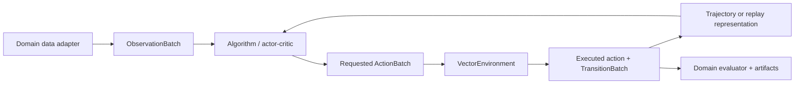

# QuantTrade

QuantTrade (`rl_quant`) is a torch-native **general deep-reinforcement-learning library** with a historical
portfolio environment and market-research components. Its RL contracts are domain-neutral: observations,
actions, transitions, trajectories, and algorithms do not import market code. Portfolio allocation is the first
application, not the definition of the framework.

The repository also retains the older two-stage **Phase-1 direct portfolio optimizer**. That workflow is useful
as a baseline, but it is not PPO and is not yet wired through the new environment/trajectory interfaces.

> **Implementation snapshot (2026-07; documentation updated 2026-08-04).** The tested library now includes recurrent PPO with masked simplex actions,
> on-policy and replay rollout coordinators, schema-locked replay, offline training, twin-critic IQL, regime
> mixtures, uncertainty abstention, market stress transforms, a purged/embargoed walk-forward splitter, and the
> vectorized portfolio environment. These are library primitives, not a production trading runner: the
> Phase-1-to-RL encoder adapter/CLI, walk-forward runtime integration, and complete artifact-driven evaluator are
> still pending. Existing TOP50/TOP2000 universes were ranked after their backtest start and remain development-only
> until rebuilt point-in-time.

See [General RL architecture](docs/general_rl_architecture.md) for the exact interfaces and limitations, and the
[migration ledger](docs/architecture_migration_plan.md) for implemented versus pending work.

## Architecture


```mermaid
flowchart LR
    D[Domain data adapter] --> O[ObservationBatch]
    O --> A[Algorithm / actor-critic]
    A --> R[Requested ActionBatch]
    R --> E[VectorEnvironment]
    E --> T[Executed action + TransitionBatch]
    T --> B[Trajectory or replay representation]
    B --> A
    T --> V[Domain evaluator + artifacts]
```

The domain-neutral layer is `rl_quant.rl`. A domain supplies an observation adapter and an environment; an
algorithm supplies action selection and updates. Requested and executed actions remain distinct, and reward is a
decomposed ledger rather than an opaque scalar.

The governing rules are:

1. **Environment ownership.** New RL algorithms do not mutate portfolio/domain state or compute reward. The
   environment executes the request and returns the authoritative transition.
2. **Point-in-time observations.** Every input and mask must have been available by its decision timestamp.
   Labels and future returns never enter an observation.
3. **Explicit missingness and feasibility.** Floating observations are finite; missingness and valid actions use
   explicit masks/channels.
4. **Terminal precision.** True termination and rollout truncation are different. Only true termination forces
   zero bootstrap discount.
5. **Reportability from artifacts.** A passing training loss is not evidence of a tradable result. Provenance,
   aligned decisions, baselines, costs, stresses, and selection history must be persisted.

## General deep-RL substrate

`rl_quant.rl` currently provides:

| Component | Implemented behavior |
|---|---|
| `TensorSpec`, `ActionSpec` | Shape/dtype/bounds validation; continuous, discrete, or hybrid descriptors; optional simplex and CASH semantics. |
| `ObservationBatch`, `ActionBatch` | Validated vectorized observations, masks, episode starts, requested actions, behavior log probabilities, entropy, and recurrent state. |
| `RewardComponents`, `TransitionBatch` | Gross return, explicit cost/penalty terms, requested/executed actions, next state, termination/truncation, discount, and diagnostics. |
| `VectorEnvironment` | Domain-neutral synchronous `reset()` / `step()` protocol. |
| `Actor`, `Critic`, `ActionValueCritic`, `Algorithm` | Small interfaces for acting, updating, checkpointing, and train/eval state. |
| `OnPolicyTrajectoryBuffer` | Time-major recurrent rollouts, GAE, correct truncation bootstrap, episode boundaries, burn-in, padding, and sequence minibatches. |
| `TransitionReplayBuffer`, `ReplayBatch` | Schema-locked circular replay preserving requested/executed actions, masks, behavior likelihoods, reward components, terminal semantics, and optional exact decision identity. |
| Rollout/training coordinators | `OnPolicyRolloutCoordinator` preserves recurrent continuation and GAE boundaries; `ReplayRolloutCollector` and `OfflineTrainer` collect and optimize replay batches. |
| `RecurrentPPO` | Clipped recurrent PPO with categorical, diagonal-Normal, or masked-Dirichlet actions, recurrent updates, checkpoints, and diagnostics. |
| `ImplicitQLearning` | Replay-based twin-critic IQL with expectile value learning, advantage-weighted behavior cloning, executed-action semantics, uncertainty penalties, and conservative transformed targets. |
| Mixture and robustness helpers | Same-support regime experts/router, critic-disagreement diagnostics, deterministic uncertainty abstention, and generic/market-specific transition stresses. |

`MaskedDirichlet` keeps masked dimensions exactly zero and samples the active simplex, so the reference
`RecurrentActorCritic(action_kind="dirichlet")` can train against `VectorPortfolioEnv`. The diagonal Normal remains
invalid for simplex allocation, and `ActionSpec(kind="hybrid")` still has no hybrid PPO distribution. Replay and
offline IQL are implemented; SAC, modern DQN, prioritized/n-step replay, and CQL are not.

## Portfolio environment

`rl_quant.envs.VectorPortfolioEnv` applies the general contracts to batched historical allocation. It accepts a
requested long-only simplex allocation including CASH and then:

- applies availability, per-risky-asset weight, and gross-exposure constraints;
- caps discretionary one-way turnover, while allowing hard feasibility changes to exceed that cap and reporting
  the forced excess;
- treats optional maximum drawdown as a post-return breach threshold that latches a CASH halt, not as a guarantee
  that an intra-step loss cannot overshoot the threshold;
- reports the request-to-execution projection distance and forced turnover;
- delegates authoritative costs for the approved target to a separate `TargetWeightExecutionModel`;
- realizes exactly one chronological asset-return vector;
- drifts holdings through realized returns instead of silently rebalancing;
- exposes equity peak, drawdown, recent turnover, gross exposure, limits, and risk-halt state to the policy;
- latches a drawdown breach, forces an immediate cost-paid CASH fallback, and keeps later actions CASH-only;
- emits decomposed reward components and equity/turnover diagnostics;
- liquidates to CASH, with cost, at a true data terminal but not a rollout truncation.

`HistoricalMarketData` requires point-in-time feature states and availability for `horizon + 1` states and one
asset-return vector for each of the `horizon` transitions. `TensorPortfolioObservationAdapter` adds current
weights, equity, time index, action mask, and episode-start state; the environment adds its own risk state without
changing that adapter signature. Optional globally unique int64 decision IDs flow into transition metadata and
can be used for exact replay alignment. Domain-specific learned encoders can implement the same adapter boundary.

The default immediate target-weight model charges configured spread/fee and optional linear-impact sensitivities;
it explicitly does not model market fills. The simulator has no partial fills, queue position, market-by-order
data, venue latency, volume/capacity calibration, empirical nonlinear impact, borrow model, built-in CASH yield,
live adaptation, or asynchronous execution. Do not describe its returns as executable-trading evidence.

## Legacy Phase-1 baseline

The runnable workflow in `../training/` predates the general RL layer.

### Stage 1: causal market context

`rl_quant.models.context_encoder.ContextEncoder` reads raw or load-time-resampled OHLCV tokens with as-of stock
covariates:

- tier 1 performs causal attention inside each fixed block;
- tier 2 performs causal attention over block summaries;
- self-supervised market and per-stock heads learn next-interval context;
- the trained encoder is frozen and cached for Stage 2.

Bar and covariate standardization uses fixed persistent moments. The driver calls
`calibrate_normalization(...)` on a deterministic **training-only** sample before optimization, excluding masked
and non-finite values, then broadcasts the buffers across ranks. `forward()` never derives or updates statistics
from its submitted session, and train/eval normalization is identical.

### Stage 2: direct differentiable allocation

The legacy decision policies combine frozen context with policy-side raw-market encoding and optional raw news.
They produce a target allocation and a continuous gate. The gate is interpolation/rebalance intensity, **not** a
sampled trade probability or literal order count. Under delayed execution, the policy observes the previously
submitted allocation at the current decision timestamp; its new target is later interpolated against the drifted
pre-trade book inside execution accounting. Future-drifted weights are never policy inputs. The trainer directly
differentiates net portfolio return; it has no critic, behavior log probability, PPO ratio, or Bellman update.

The repaired daily-raw path trains and reports on the same one-day close-to-close reward. Longer-horizon returns
are auxiliary forecasting/SSL targets, and validation/test can carry an input-only causal history prefix that is
excluded from control and scoring. Overlapping training windows likewise use observation-only prefixes to warm
temporal state while keeping the book in cash, score each warmed date once, and charge entry turnover on the first
scored allocation. They do not liquidate at arbitrary sampling boundaries; continuous evaluation liquidates once
at the true split end. Legacy rollouts now share portfolio helpers for availability, turnover, holdings drift,
and terminal liquidation, but they still do not call `VectorPortfolioEnv`.

Keep this path as a named direct-optimization baseline while the [migration](docs/architecture_migration_plan.md)
proceeds.

## Causal data and provenance

The Phase-1 raw dataset layout is:

```text
DATA_ROOT/
  manifest.json
  universe.json
  universe_membership.parquet       # required for point_in_time/rolling mode
  partitions/
    <start>_to_<end>/
      bars.parquet
      covariates.parquet
      news.jsonl                    # optional, research-only with current scorer metadata
```

`universe.json` stores unique policy action IDs. Optional `source_symbol_aliases` maps an action ID to the raw
market ticker when a source symbol collides with a reserved action; for example, `EQUITY:CASH -> CASH` keeps the
listed equity distinct from synthetic portfolio cash across bars, covariates, news, and membership events.

The organizer creates session-aligned OHLCV, as-of covariates with per-field validity, raw per-article scores,
availability/membership masks, and forward labels. A coarser `bar_seconds` grid performs standard OHLCV
resampling at load time; it does not persist a technical-feature table.

`inspect_dataset_provenance()` checks `manifest.json` and `universe.json` before training. Reportability fails
when universe selection metadata is absent/invalid, when selection postdates the sample start, or when rolling/PIT
membership lacks a non-empty event table. Dynamic membership must match the declared action universe and contain
at least one positive event for every non-CASH action. The declared coverage start must also match the earliest
actual date inside the bars files. Membership events apply only after both their effective date and availability
timestamp. A prior-selected static universe can pass the mechanical gate but keeps a delisting/survivorship warning.

The current ranked TOP50/TOP2000 assets were selected using 2026 information for a sample beginning in 2022.
Use `--allow-unreportable` only for an explicitly development-only diagnostic; it is not a promotion path.

News is disabled by default. The stored article timestamps can be filtered causally, but the existing scorer's
model-availability metadata is anachronistic for the historical sample. Enable `--news` only as research input;
the fail-closed audit checks every active news window, and a reportable run requires period-correct scores plus
complete deterministic-extractor provenance. Each model-facing row must also have a ticker, an exact integer
availability timestamp, and a finite numeric sentiment score in `[-1, 1]`; malformed rows are rejected rather
than converted to neutral sentiment. Tickers must map to a declared non-CASH action, and model/prompt/schema
identifiers must be canonical non-empty strings, so audited articles cannot disappear during tensorization.

## Package layout

| Path | Role |
|---|---|
| `src/rl_quant/rl/` | Domain-neutral contracts, trajectories/replay, rollout coordination, PPO, IQL, regime mixtures, and robustness helpers. |
| `src/rl_quant/envs/` | Historical market container, observation adapter, portfolio environment, and market-specific robust transforms. |
| `src/rl_quant/execution/` | Target-weight execution/cost authority and pure portfolio accounting helpers. |
| `src/rl_quant/models/` | Legacy market context and allocation models. |
| `src/rl_quant/datasets/` | Raw-window organization, provenance/membership, chronological and tested purged/embargoed walk-forward splits, daily episodes, and streaming. |
| `src/rl_quant/training/` | Legacy two-stage direct trainers and experiment designs. |
| `src/rl_quant/evaluation/` | Statistical/reportability utilities; not yet an end-to-end evaluator for the new RL path. |
| `src/rl_quant/protocol/`, `reportability/` | Research contracts, validators, baselines, and decision-log utilities. |
| `src/rl_quant/features/` | Offline/legacy artifact-producer namespace; not imported by the audited raw Phase-1 training path. |
| `training/` (repository parent) | Resumable Phase-1 experiment and sweep drivers. |

Import layering is enforced by `tests/test_import_boundaries.py`.

## Install

Use the `quanttrade` conda environment (Python 3.11):

```bash
cd QuantTrade
conda run -n quanttrade python -m pip install -e ".[dev,data]"
```

Core dependencies are intentionally small (`torch`, `numpy`). Parquet/data tooling and offline language-model
scoring are optional extras. Training consumes frozen news scores; it never invokes an LLM.

## Run the legacy Phase-1 experiment

There is not yet a production RL rollout command. The following commands run the **legacy direct baseline**:

```bash
# CPU correctness smoke
conda run -n quanttrade python ../training/train_phase1.py --smoke --allow-unreportable

# One design; fail-closed provenance and news-off are defaults
conda run -n quanttrade python ../training/train_phase1.py \
  --design daily_raw --data-root "$DATA_ROOT" --device cuda:0 --seeds 5

# Explicit TOP50 wide screen: one paired seed, four independent one-GPU jobs
conda run -n quanttrade python ../training/sweep_phase1.py \
  --designs top50-wide --devices 0,1,2,3 --vram-ceiling-gib 75 --seeds 1

# Serious TOP2000 wide study: four independent one-GPU settings at a time, one seed each
conda run -n quanttrade python ../training/sweep_phase1.py \
  --designs top2000-wide --devices 0,1,2,3 --gpus-per-job 1 --seeds 1
```

Use `--stream` for large datasets. Large-universe execution should wait until provenance passes and the smaller
PIT universe has cleared correctness, baseline, and artifact gates.

## Testing and quality

```bash
cd QuantTrade
PYTHONPATH=src conda run -n quanttrade python -m pytest tests/ -q
conda run -n quanttrade ruff check src tests
```

The most relevant contract suites are:

- `test_rl_core.py`: typed batches, reward ledger, GAE, terminals, recurrent burn-in;
- `test_ppo.py`: categorical/Normal/Dirichlet distributions, PPO updates/checkpoints, planted-signal learning;
- `test_replay.py`, `test_offline.py`, `test_iql.py`: replay integrity, collectors/trainers, and executed-action IQL;
- `test_mixture.py`, `test_market_robust_transforms.py`: regime routing and conservative scenario transforms;
- `test_rollout.py`: recurrent continuation, terminal/truncation bootstrapping, and collect-to-update integration;
- `test_portfolio_env.py`: execution authority, risk state/halt, identity, costs, constraints, drift, and liquidation;
- `test_context_normalization.py`: causal fixed statistics and serialization;
- `test_dataset_provenance.py`: future-universe rejection and event-time membership;
- `test_walk_forward.py`: purge/embargo geometry, expanding/rolling folds, stable identities, and fail-closed validation;
- `test_daily_runtime_accounting.py`: compact daily storage and legacy accounting.

## Reportability

A result is not reportable merely because the driver completes. At minimum:

- every observation, universe event, and model-produced input is available by its decision time;
- train/validation/test periods and normalization fit windows are disjoint and persisted;
- evaluation uses the same action feasibility, execution, costs, holdings drift, and liquidation semantics as
  training;
- requested/executed actions, masks, reward components, equity, decisions, seeds, and selection history are
  persisted;
- baselines are aligned to identical dates and pay comparable costs;
- uncertainty, multiple testing, and cost/capacity stresses are reported;
- the test split is not used to choose a seed, checkpoint, architecture, or hyperparameter.

The Hold-30 path now has package-owned chronological training, checkpoint/resume,
cohort telemetry, and receipt primitives. The current scientific design is the
immutable `prelockbox-hold30-active-alpha-m03r-v6` generation. It treats 30
sessions as a weak one-sided persistence prior—not a minimum hold, sell mask,
expiry, or promotion gate—while retaining v5's active-beta, confidence-budget,
30-return/63-session separation, and 252-session learned-context corrections.
V5, v4, and v3 remain unchanged prelaunch audit generations; v2 was superseded
before launch.

M03R v6 currently has typed protocol, soft early-exit objective, cause-typed
cohort-release qualification, and duration-free checkpoint-gate/ranking
qualification. Its production trainer and governed 12-setting execution path
are not yet connected. It remains launch-blocked pending verified calibration
and ensemble/execution receipts, numerical factor/sector bounds, the complete
inferential family, point-in-time real-data/global-path bindings,
evaluator-derived checkpoint evidence, empirical execution, an immutable
image, single-/two-rank CUDA parity, and an H100 capacity receipt.
There is no M03R real-data training or performance result. Synthetic software
qualification is not investment-performance evidence.

The legacy Phase-1 verdict reports split-level `statistically_positive` diagnostics separately from its promotion
gate. Dataset/news provenance now participates in `positive`, so a run admitted with `--allow-unreportable` is
forced non-positive and remains development-only.

## Documentation

- [ADR-0006: one daily decision with a soft 30-session holding target](docs/adr/0006-daily-decision-soft-30-session-holding.md)
- [ADR-0007: benchmark-relative alpha is the Hold-30 promotion objective](docs/adr/0007-benchmark-relative-hold30-alpha-objective.md)
- [Hold-30 policy redesign RFC](docs/daily_hold30_policy_rfc.md)
- [Normative pre-lockbox Hold-30 H0–H3 base specification](docs/prelockbox_hold30_h0_h3_experiment.md)
- [Current launch-blocked M03R v6 soft-persistence specification](docs/prelockbox_hold30_active_alpha_m03r_v6.md)
- [Immutable M03R v5 active-alpha Hold-30 specification](docs/prelockbox_hold30_active_alpha_m03r_v5.md)
- [Frozen M03R v4 specification](docs/prelockbox_hold30_active_alpha_m03r_v4.md)
- [Superseded-before-launch Hold-30 alpha mechanism-8 v3 audit specification](docs/prelockbox_hold30_alpha_mech8_v3.md)
- [Hold-30 alpha v3 sealed-evaluation contract](docs/prelockbox_hold30_alpha_evaluation_v3.md)
- [Superseded-before-launch mechanism-8 v2 audit record](docs/prelockbox_hold30_mech8_v2.md)
- [Seadragon training-source lineage](docs/SEADRAGON_TRAINING_SOURCE.md)
- [General RL architecture and exact current limitations](docs/general_rl_architecture.md)
- [Deep-RL migration ledger](docs/architecture_migration_plan.md)
- [Decision tensor and reportability protocol](docs/decision_tensor_protocol.md)
- [Architecture decision records](docs/adr/README.md)
- [News-model provenance protocol](docs/news_llm_covariate_protocol.md)
