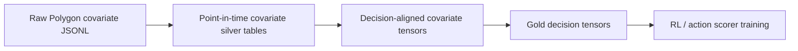

# Stock Covariate Data And Framework Integration

This document describes the newly downloaded Polygon stock-specific covariates,
their time structure, and the work required before they can be used safely by
the QuantTrade RL framework.

The key point is simple:

```text
The current framework can support richer covariate tensors,
and Phase 1 now converts raw stock covariate JSONL files into point-in-time
action-level inputs for the second-context scorer.
```

## Current New Data

### 1-Second Top-500 Stock Bars

Purpose:

- Learn intraday market dynamics from high-frequency stock activity.
- Build hour-level decisions from second-level source context.
- Support both hourly RL and second-context action-scoring datasets.

Current raw locations:

```text
../data/polygon/second_aggs/top500_common_stocks_2025_to_2026-06-15
../data/polygon/second_aggs/top500_common_stocks_2023_to_2025-01-01
```

Format:

```text
manifest.csv
dataset_manifest.json
SYMBOL/YYYY/MM/YYYY-MM-DD.parquet
```

Frequency:

- Nominal frequency: `1s`.
- Actual rows are sparse: a missing second means no eligible aggregate bar for
  that symbol-second.
- These rows should never be interpreted as dense zero-return seconds.

Current protocol conversion target:

```text
../data/protocol/polygon_second_top500_2025_to_2026-06-15
```

### Stock-Specific Covariates

Purpose:

- Add stock identity, fundamentals, corporate actions, and news context.
- Improve action scoring for individual stock actions.
- Add market ecology features beyond short-term second-bar price and volume.

Current raw location:

```text
../data/polygon/stock_covariates/top500_2023_to_present
```

Current manifest:

```text
../data/polygon/stock_covariates/top500_2023_to_present/manifest.csv
```

Download range:

```text
2023-01-01 through 2026-06-15
```

Universe:

```text
../data/polygon/universes/top_500_s3_volume_common_stocks_2026-06-12_tickers.txt
```

Raw file layout:

```text
top500_2023_to_present/
  dataset_manifest.json
  manifest.csv
  reference/
    ticker_types.jsonl
  SYMBOL/
    overview_snapshots.jsonl
    financials.jsonl
    dividends.jsonl
    splits.jsonl
    news.jsonl
```

Live snapshot during active download:

```text
completed symbols: 114 / 500
raw covariate size: 380M
manifest rows: 571
status counts: 423 downloaded, 148 empty
rows by dataset:
  overview_snapshots: 4,902
  financials: 1,436
  dividends: 899
  splits: 16
  news: 226,013
  ticker_types: 24
```

These counts are a progress snapshot. They will change while the detached
download process continues.

## Covariate Frequencies

The covariates are time varying, but not at one uniform frequency.

| Dataset | Raw Frequency | Time-Varying Behavior | Model Treatment |
| --- | --- | --- | --- |
| `overview_snapshots` | Monthly snapshots in the current download | Slowly changing reference and market fields such as market cap, shares, listing state, exchange, and company metadata | Use the latest snapshot available before the decision timestamp. Add missingness and age features. |
| `financials` | Quarterly and annual filings | Fundamentals change when a new filing becomes available | Use filing availability, not fiscal period end alone. Forward-fill only after filing date. |
| `dividends` | Event based | Ex-dividend, declaration, record, and payment events | Use trailing known events. Future events are allowed only if declaration availability is before the decision. |
| `splits` | Event based | Split execution events | Use trailing known events and split-adjustment features. Avoid future split leakage. |
| `news` | Irregular intraday events | Many records per day for liquid symbols; sparse for smaller names | Use timestamped trailing-window counts or embeddings. Do not use article text unless its publication timestamp is causal. |
| `ticker_types` | Reference table | Mostly static provider taxonomy | Use as metadata only after schema validation. |

## Current Framework Capability

The framework is partly ready.

What already works:

- Model modules infer feature dimensions from loaded tensors.
- The second-context model can accept wider `market_context` and
  `action_features` tensors.
- The hour-from-second model can accept wider `subhour_features` and
  `hour_features` tensors.
- Dataset validators already check feature-name widths, masks, invalid-return
  semantics, and timestamp causality for existing tensors.
- `model_input_keys` and `forbidden_model_input_keys` already define which
  tensors are safe model inputs.

What now works:

- `src/rl_quant/data_sources/polygon_stock_covariates.py` parses raw
  `overview_snapshots.jsonl`, `financials.jsonl`, `dividends.jsonl`,
  `splits.jsonl`, and `news.jsonl` records.
- `scripts/build_stock_covariate_silver_features.py` writes a point-in-time
  silver layer with `manifest.csv`, `feature_schema.json`,
  `coverage_report.json`, and one `SYMBOL.parquet` per symbol.
- `scripts/build_second_context_decision_dataset.py` accepts
  `--include-action-covariates`, `--covariates-root`,
  `--covariate-feature-schema`, `--covariate-join-mode`,
  `--covariate-max-age-days`, and `--covariate-strict-coverage`.
- The second-context payload can include `action_covariates`,
  `action_covariate_mask`, `action_covariate_available_timestamps_ms`,
  `action_covariate_age_seconds`, `action_covariate_feature_names`, and
  covariate schema/source hashes.
- Phase 1 appends compact covariates to `action_features` for model
  compatibility and also stores the explicit optional covariate tensors for
  audit.
- `docs/news_llm_covariate_protocol.md` defines the separate
  `stock_news_llm_v1` layer for audited news-derived features.
- `scripts/build_news_article_table.py`, `scripts/build_news_llm_features.py`,
  and `scripts/build_news_llm_aggregates.py` build deduplicated news articles,
  article-ticker extraction rows, and optional hour-from-second action sidecars.
- The current local analyst stack uses Qwen/Qwen3-1.7B as primary,
  google/gemma-4-26B-A4B-it as validator/fallback, and
  mistralai/Mistral-Small-3.2-24B-Instruct-2506 as structured-output fallback.
  `Qwen/Qwen3.6-27B` remains an explicit larger-model preset, not the default
  local path on the 10 GiB GPU used for this project stage.
  The frozen model manifest must be attached to any imported LLM feature table.

What still does not work:

- Market-level covariates are intentionally not implemented yet.
- Hour-from-second datasets consume news LLM aggregates only when
  `--news-llm-sidecar` is explicitly enabled for training.
- `stock_fundamental_llm_v1` is not implemented yet. Fundamental ratios remain
  deterministic `stock_covariates_v1` inputs until a separate cached LLM silver
  layer exists.
- Existing warm-start checkpoints require exact feature schema matches, so an
  old non-covariate checkpoint cannot strictly warm-start into a covariate
  model without an explicit compatibility path.

## Main Integration Problem

The hard part is not model capacity. The hard part is safe point-in-time feature
construction across mixed-frequency data.

Each decision row must answer:

```text
For this decision timestamp and this action symbol,
which covariate records were actually known before the decision?
```

Wrong handling creates look-ahead leakage. Common leakage risks:

- Using a fiscal quarter end instead of the actual filing date.
- Using an overview snapshot that reflects later corporate state.
- Using future declared dividends before the declaration was public.
- Using split events before their announcement or effective availability.
- Using news that was published after the decision timestamp.
- Forward-filling delisted, renamed, or missing symbols without an active flag.

## Recommended Protocol Extension

Add a covariate silver layer before touching model training.



### Silver Layer

Recommended output:

```text
../data/polygon/stock_covariates/silver/top500_2023_to_present/
  manifest.csv
  feature_schema.json
  SYMBOL.parquet
```

Each symbol row should contain:

```text
symbol
event_timestamp_ms
available_timestamp_ms
source_dataset
feature_*
missing_*
age_seconds_*
```

Rules:

- `available_timestamp_ms` is mandatory.
- `available_timestamp_ms <= decision_timestamp_ms` is required before a
  feature can become model input.
- Raw text should not go directly into the compact tensor. News should first be
  compressed into counts, source counts, simple sentiment, or embeddings with
  explicit availability timestamps.
- Missingness should be encoded explicitly. A missing fundamental filing is
  information, not zero.

### Gold Tensor Options

Option A: append covariates to existing action features.

```text
action_features:
  shape [decisions, actions, action_feature_count + covariate_feature_count]
```

Best for:

- Stock-specific fundamentals.
- Market cap, shares outstanding, listing age.
- Dividend and split history.
- Per-action trailing news features.

Option B: append aggregate covariates to market context.

```text
market_context:
  shape [decisions, lookback_blocks, market_feature_count + market_covariate_count]
```

Best for:

- Cross-sectional valuation dispersion.
- Fraction of universe with recent filings.
- Market-wide news intensity.
- Sector or exchange concentration.

Option C: add explicit optional tensors.

```text
action_covariates
action_covariate_mask
action_covariate_available_timestamps_ms
action_covariate_age_seconds
action_covariate_feature_names
market_covariates
market_covariate_mask
market_covariate_available_timestamps_ms
```

Best for:

- Future-proofing.
- Keeping price/volume context separate from slower covariates.
- More transparent validation.

For the current codebase, Phase 1 uses Option A for model compatibility and
keeps the Option C action-level tensors as audit artifacts. Market-level Option
C tensors remain a Phase 2 extension.

## Initial Feature Set

A compact first version should avoid raw text and high-cardinality categorical
explosion.

Recommended action-level features:

```text
log_market_cap
log_share_class_shares_outstanding
days_since_listed
is_common_stock
is_adr_or_foreign
is_active_reference_record
days_since_last_financial_filing
financial_records_last_365d
revenue_yoy_growth
net_income_margin
debt_to_assets
cash_to_assets
operating_cashflow_to_assets
days_since_last_dividend
trailing_12m_dividend_count
trailing_12m_dividend_cash
days_since_last_split
split_events_last_365d
log1p_news_count_1d
log1p_news_count_7d
log1p_news_count_30d
log1p_weighted_news_count_1d
log1p_weighted_news_count_7d
multi_ticker_news_fraction_1d
news_publisher_count_7d
news_top_publisher_share_7d
news_missing_flag
covariate_age_seconds
```

News counts are log-scaled after point-in-time article deduplication. Multi-ticker
articles are also mention-weighted, so a broad article tagged to several symbols
does not enter every action as a full independent stock-specific event.

Recommended market-level aggregate features:

```text
universe_covariate_coverage_fraction
market_cap_top10_concentration
median_log_market_cap
cross_section_revenue_growth_median
cross_section_revenue_growth_iqr
cross_section_debt_to_assets_median
filing_event_fraction_7d
dividend_event_fraction_30d
split_event_fraction_365d
news_intensity_1h
news_intensity_1d
news_symbol_coverage_1d
```

## Required Code Changes

1. Add a raw covariate loader. Implemented.

```text
src/rl_quant/data_sources/polygon_stock_covariates.py
```

Responsibilities:

- Read JSONL by symbol and dataset.
- Normalize nested records into typed rows.
- Resolve symbol path naming, including symbols like `BRK.B`.
- Preserve raw source fields needed for audit.

2. Add a silver feature builder. Implemented.

```text
scripts/build_stock_covariate_silver_features.py
```

Responsibilities:

- Build compact point-in-time features per symbol.
- Emit `available_timestamp_ms`.
- Emit missingness and age features.
- Write a feature schema and manifest.

3. Extend protocol conversion. Implemented for second-context action
covariates.

```text
scripts/convert_polygon_second_to_protocol.py
scripts/build_second_context_decision_dataset.py
```

Implemented flags:

```text
--covariates-root
--covariate-feature-schema
--include-action-covariates
--include-market-covariates
--covariate-join-mode latest_before_decision
--covariate-max-age-days
--covariate-strict-coverage
```

`--include-market-covariates` currently fails loudly because market-level
aggregate covariates are not implemented yet.

4. Extend validators. Implemented for action covariates.

Required checks:

- Covariate tensor row count matches decision rows.
- Action covariate action dimension matches `action_names`.
- Every nonnegative covariate availability timestamp is at or before the
  decision timestamp.
- Feature-name counts and schema hashes match tensor widths.
- Covariate label or future-only fields are not in `model_input_keys`.

5. Handle warm-start compatibility.

Options:

- Start a new covariate-enabled training run with no old checkpoint.
- Or implement partial warm-start that loads matching old layers and
  initializes widened input projections explicitly.

The current strict warm-start policy is correct for reportability. It should
not be relaxed silently.

## Recommended First Implementation

Use the smallest safe path:

```text
Raw covariate JSONL
-> action-level covariate silver Parquet
-> append to action_features
-> train second-context action scorer
-> evaluate sequential diagnostics
```

This avoids rewriting the hour-from-second RL environment first and lets us
measure whether the covariates improve action ranking.

After that:

```text
Add market aggregate covariates
-> rebuild hour_from_second_dataset.pt partitions
-> restart rolling hour-level RL under the new schema
```

## Reportability Checklist

A covariate-enabled run is reportable only if:

- Source covariate download completeness is recorded.
- Raw covariate manifest hashes are included.
- Silver feature schema and hashes are included.
- All covariate availability timestamps are causal.
- Normalization statistics are fit on train only.
- Missingness is represented explicitly.
- Split boundaries are respected for both price labels and covariates.
- Existing non-covariate checkpoints are not loaded under a changed feature
  schema unless a documented partial-load rule is used.
- The run manifest states exactly which covariate groups were enabled.

## Bottom Line

The new data is valuable, especially for single-stock action scoring, but it is
not automatically usable by the current framework. The models can consume wider
tensors. The missing piece is a compact, point-in-time covariate protocol that
turns mixed-frequency raw JSONL data into audited numeric features with
availability timestamps.
